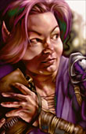

<h1>Alora NPC for BGII (WIP)</h1>

<h3>A TeamBG mod Baldur's Gate II: ToB (classical and EE games), 
Baldur's Gate Trilogy and EET<h3>

 

**Original Author:** <a href="http://www.baldursgatemods.com/forums/index.php?action=profile;u=3">Raven</a>  
**Mod Website and Forum:** <a href="http://www.baldursgatemods.com/forums/index.php?board=13.0">Alora</a> 

## 

:warning: Readme writing in progress... Don't try to download and install this mod as it is a WIP version and its install will fail, because of missing files still in development or in beta testing

**Note:** This mod is officially released at <a href="http://www.baldursgatemods.com/forums/index.php">TeamBG.com</a>. I updated it and gathered classical and EE versions in one single package with Solaufein approval. 

## 

 

[Read the mod's readme](https://gwendolynefreddy.github.io/docs/alora/alora-readme.html)

[Download the mod at TeamBG](http://www.baldursgatemods.com/forums/index.php?action=downloads;sa=view;down=25) 

## Overview

 This mod brings Alora, the halfling thief, from Baldur's Gate to Baldur's Gate II. She can be found in Ribald's store.

## Details

Alora is a Chaotic Good Swashbuckler.

## 

#### Statistics

- Level 9 (When you meet her)
- Strength 12
- Dexterity 19
- Constitution 12
- Intelligence 14
- Wisdom 7
- Charisma 15

## 

#### Biography

> When asked about her past, ALORA reveals that she was originally from Iriaebor. As a child she was cute, outgoing, and dangerously curious, causing no end of trouble for her parents. They tried to curb her lunatic behavior, and encouraged her to be content with home and hearth like other halflings. Alora found this unbearably stifling, and left to explore the world. She quickly found herself falling into all sorts of trouble, going to the wrong places and angering the wrong sorts of people. Eventually she found herself in the city of Baldur's Gate, and it was there that she discovered her future profession: thievery. Wealth was never her chief concern; it's just that too many interesting things are behind locked doors. Her unassuming temperament makes it easy for her to hoodwink the authorities, and her sweet nature has saved her from a jail cell numerous times.

## 

#### NPC Relationships

She will have at least 2 banters with all members of the party more on some others. She will have many interjections also.

<a href="#top">Back to top</a>

## Version History

#### Version 2.0 &nbsp;(January 23, 2021)

- Added *alora.ini* metadata file to support AL|EN's "Project Infinity".
- Renamed *setup-alora.tp2* -> *alora.tp2*, and moved it into *alora* top-folder to support AL|EN's "Project Infinity".
- Replaced `AUTHOR` keyword with `SUPPORT`.
- Replaced `AT_INTERACTIVE_EXIT` deprecated command with `README`.
- Used `HANDLE_CHARSETS` function to convert string entries for EE games.
- Added component `DESIGNATED` number and "*alora_npc_for_bg2*"`LABEL`.
- Gathered Alora mod for classical BG2 and BG2:EE in one single package, and added native EET compatibility.
- Commented code as much as possible.
- Removed useless pdialog.2da and interdia.2da patching for BG2 standalone games.
- bcmalor.d: Integrated <a href="http://www.shsforums.net/topic/42220-fixes-for-the-big-fixpack/page-49#entry561215">Lollorian's class script trigger fixes</a>.
- ucmg702.baf: Added "`Continue()`" to the script block that is patched via `EXTEND_TOP`.
- Rewrote installation procedure to use WeiDU's built-in `HANDLE_AUDIO` function.
- Added Alora and Edwin sound clips for every translated language.
- Fixed Alora portraits in EE games and removed portraits installation as they already exists in games biff files.
- Added foreign languages WeiDU prompts whenever possible.
- Proofread tra files (jazira).
- Added French translation (by tonton-thon), proofread by jazira.
- Re-formated, updated and renamed readme file to *alora-readme.html* and moved it into new *readme* folder.
- Removed useless portraits and backup folder.
- Lower cased files.
- Updated OggDec to v1.9.7.
- Added archive libiconv-1.9.2-1-src.7z with iconv licence info.
- Included Linux and Mac Os X versions in the same package (thanks AL|EN's Infinity Auto Packager tool!).
- Updated WeiDU installer to v247.

**TODO :** 
>Revamp scripts and dialogs: Replace old-school trigger conditions `!StateCheck("XXX",STATE_SLEEPING)` and `IsValidForPartyDialog` with more accurate CamDawg's `!StateCheck("XXX",CD_STATE_NOTVALID)` and `InParty("XXX")` whenever needed.
